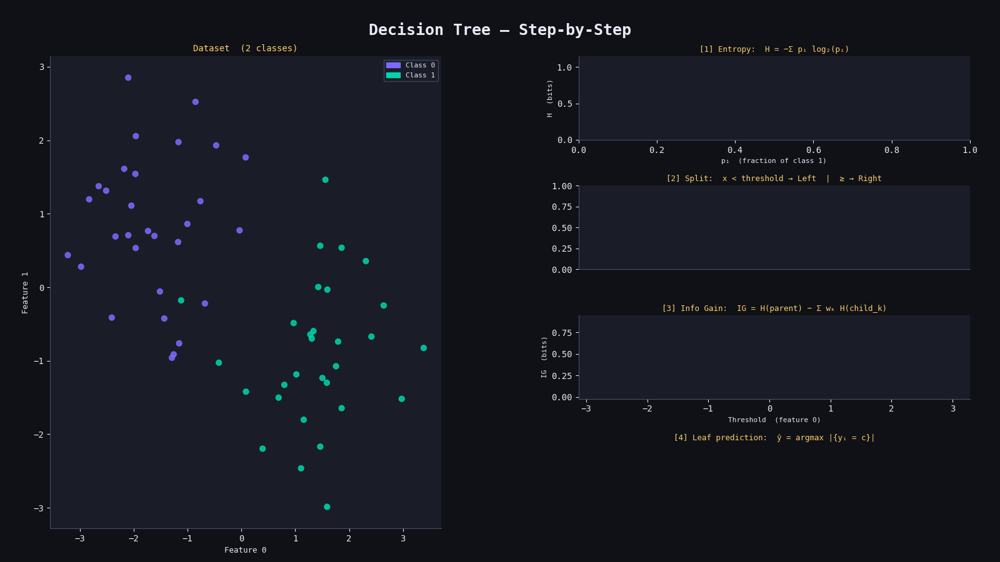

# 🌳 Decision Tree Classifier from Scratch

A clean NumPy implementation of a Decision Tree Classifier, trained and evaluated on the Breast Cancer dataset from scikit-learn.

---

## 📁 Project Structure

```
├── decision_tree.py     # Core Decision Tree implementation
├── helper_function.py   # Accuracy utility
└── main.py              # Training & evaluation script
```

---

## ⚙️ How It Works

The tree is built recursively by finding the best feature + threshold to split on at each node, maximizing **Information Gain**.

### 1. 🔢 Entropy

Measures the impurity (disorder) of a set of labels:

$$H(y) = -\sum_{i} p_i \log(p_i)$$

- $p_i$ = proportion of class $i$ in the node
- $H = 0$ → perfectly pure node
- $H = 1$ → maximally mixed (binary case)

### 2. 📈 Information Gain

How much a split reduces entropy:

$$IG = H(\text{parent}) - \left(\frac{n_{\text{left}}}{n} \cdot H(\text{left}) + \frac{n_{\text{right}}}{n} \cdot H(\text{right})\right)$$

- The split with the **highest IG** is chosen at each node
- A gain of $0$ means the split is useless

### 3. ✂️ Splitting Rule

$$x[\text{feature}] < \text{threshold} \Rightarrow \text{left}$$
$$x[\text{feature}] \geq \text{threshold} \Rightarrow \text{right}$$

### 4. 🏷️ Leaf Prediction

At a leaf node, the prediction is the **majority class**:

$$\hat{y} = \arg\max_{c} \, |\{y_i = c\}|$$

---

## 🚀 Usage

```python
from decision_tree import DecisionTree
from helper_function import accuracy

clf = DecisionTree(max_depth=10)
clf.fit(X_train, y_train)
predictions = clf.predict(X_test)
print("Accuracy:", accuracy(y_test, predictions))
```

---

## 🛠️ Parameters

| Parameter | Default | Description |
|---|---|---|
| `min_samples` | `2` | Minimum samples required to split a node |
| `max_depth` | `100` | Maximum depth of the tree |
| `n_features` | `None` | Number of features to consider per split (random subset) |

---

## 📊 Results

Evaluated on the **Breast Cancer Wisconsin** dataset (80/20 split):

| Metric | Value |
|---|---|
| Dataset | Breast Cancer (sklearn) |
| Test Size | 20% |
| Accuracy | ~92–96% |

---

## 📦 Dependencies

```
numpy
scikit-learn
```

Install with:
```bash
pip install numpy scikit-learn
```

## Result

<p align="center">
  
</p>
