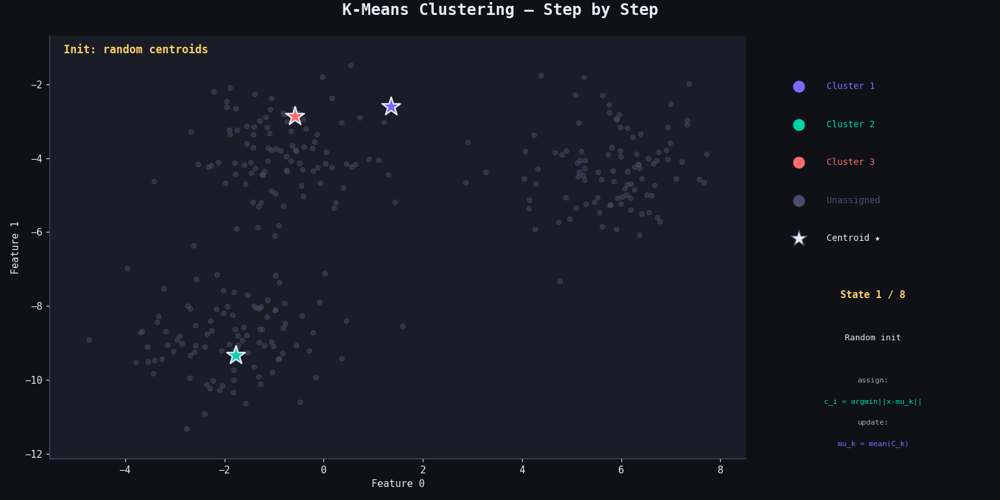

# K-Means Clustering from Scratch

A clean NumPy implementation of the K-Means clustering algorithm — an unsupervised technique that partitions data into K groups by iteratively refining cluster centroids.

---

## Project Structure

```
├── kmeans.py    # Core K-Means implementation
└── main.py      # Run clustering & visualise
```

---
## How It Works

K-Means alternates between two steps until convergence: **assigning** each point to its nearest centroid, then **updating** each centroid to the mean of its assigned points.

---

### 1. Initialisation

K centroids are chosen randomly from the data points (without replacement):

$$\mu_1, \mu_2, \ldots, \mu_K \sim \text{RandomSample}(X, K)$$

The choice of initial centroids affects convergence speed — bad initialisations can lead to local optima.

---

### 2.Euclidean Distance

The distance between a point and a centroid is:

$$d(x, \mu_k) = \|x - \mu_k\|_2 = \sqrt{\sum_{j=1}^{p}(x_j - \mu_{k,j})^2}$$

---

### 3. Assignment Step (E-step)

Each sample is assigned to the nearest centroid:

$$c_i = \arg\min_{k \in \{1,\ldots,K\}} \; d(x_i, \mu_k)$$

This partitions the data into K clusters:

$$\mathcal{C}_k = \{i : c_i = k\}$$

---

### 4. Update Step (M-step)

Each centroid is recomputed as the **mean** of all points in its cluster:

$$\mu_k \leftarrow \frac{1}{|\mathcal{C}_k|} \sum_{i \in \mathcal{C}_k} x_i$$

---

### 5. Convergence

The algorithm stops when centroids no longer move:

$$\sum_{k=1}^{K} \|\mu_k^{(\text{new})} - \mu_k^{(\text{old})}\|_2 = 0$$

---

### 6. Objective Function (Inertia)

K-Means minimises the **within-cluster sum of squared distances**:

$$J = \sum_{k=1}^{K} \sum_{i \in \mathcal{C}_k} \|x_i - \mu_k\|^2$$

This is also called **inertia** or WCSS. Lower is better.

---
## Results

Applied to `make_blobs` with 3 ground-truth clusters:

| Metric | Value |
|---|---|
| Samples | 500 |
| Features | 2 |
| Clusters (K) | 3 |
| Max Iterations | 150 |
| Typical convergence | ~10 iterations |

---

## 📦 Dependencies

```
numpy
scikit-learn
matplotlib
```

Install with:
```bash
pip install numpy scikit-learn matplotlib
```

## Result

<p align="center">
  
</p>
