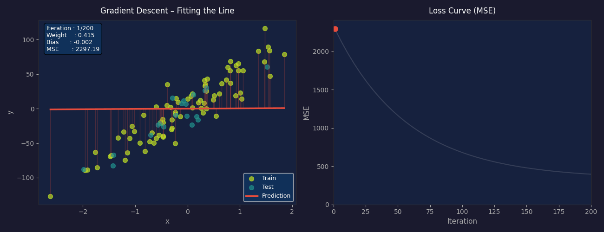

# Linear Regression from Scratch

A simple implementation of Linear Regression using gradient descent, built with NumPy and tested on a synthetic dataset.

## Files

| File | Description |
|---|---|
| `linear_regression.py` | Linear regression model implementation |
| `helper_functions.py` | MSE loss function |
| `main.py` | Training, prediction, and plotting |
| `linear_regression_animation.py` | Gradient descent step-by-step animation |

## How It Works

1. **Initialize** weights and bias to zero
2. **Forward pass** — compute predictions: `y = X·w + b`
3. **Compute gradients** of MSE loss with respect to weights and bias or we can use MAE loss
4. **Update** weights and bias using gradient descent
5. Repeat for `n_iters` iterations

## Getting Started

**Install dependencies:**
```bash
pip install numpy matplotlib scikit-learn
```

**Run the model:**
```bash
python main.py
```

**Run the animation:**
```bash
python linear_regression_animation.py
```

## Animation

The animation visualizes gradient descent in two panels:
- **Left** — regression line fitting the data with residual errors shown in real time
- **Right** — MSE loss curve decreasing over iterations

The GIF is saved automatically as `linear_regression_animation.gif`.

## Results

Trained on a synthetic regression dataset (100 samples, noise=20):

```
Mean Square Error: ~450
```
<p align="center">
  
</p>

