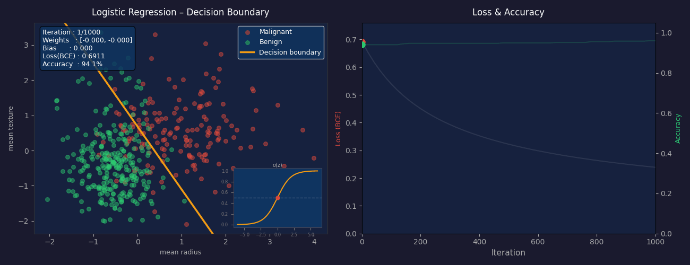

# Logistic Regression from Scratch

A simple implementation of Logistic Regression using gradient descent, built with NumPy and tested on the Breast Cancer dataset.

## Files

| File | Description |
|---|---|
| `logistic_regression.py` | Logistic regression model implementation |
| `helper_functions.py` | Sigmoid activation and accuracy functions |
| `main.py` | Training, prediction, and accuracy evaluation |
| `logistic_regression_animation.py` | Gradient descent step-by-step animation |

## How It Works

1. **Initialize** weights and bias to zero
2. **Forward pass** — compute linear prediction then apply sigmoid: `σ(X·w + b)`
3. **Compute gradients** of Binary Cross-Entropy loss
4. **Update** weights and bias using gradient descent
5. **Classify** — predict class 1 if `σ(z) > 0.5`, else class 0

## Getting Started

**Install dependencies:**
```bash
pip install numpy matplotlib scikit-learn
```

**Run the model:**
```bash
python main.py
```

**Run the animation:**
```bash
python logistic_regression_animation.py
```

## Animation

The animation visualizes gradient descent in two panels:
- **Left** — scatter plot of training data with the decision boundary shifting in real time, plus a sigmoid curve inset
- **Right** — Binary Cross-Entropy loss decreasing and accuracy increasing over iterations

The GIF is saved automatically as `logistic_regression_animation.gif`.

## Results

Tested on the Breast Cancer dataset (569 samples, 30 features):

```
Classification Accuracy: ~92%
```
<p align="center">
  
</p>