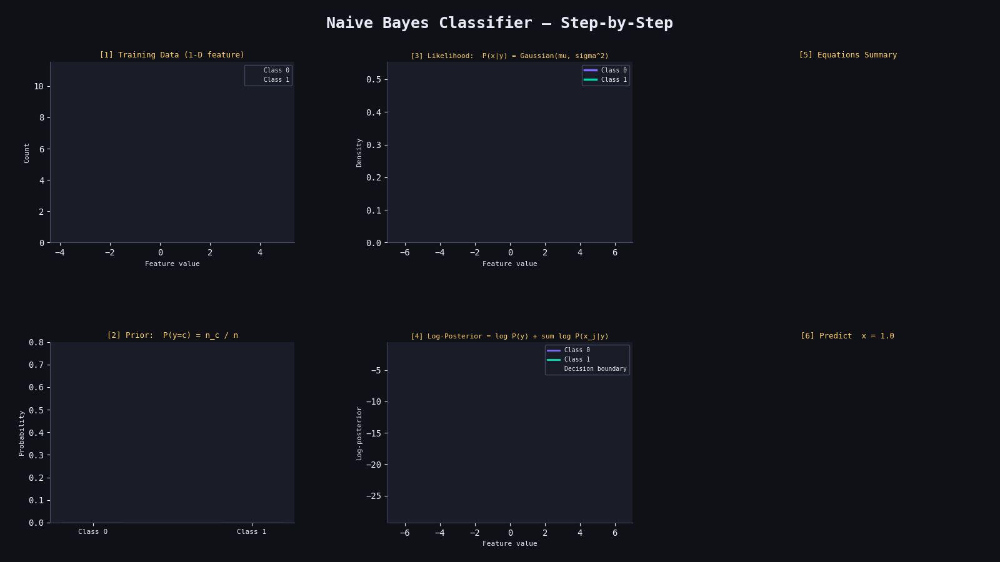

# 📊 Naive Bayes Classifier from Scratch

A clean NumPy implementation of a Gaussian Naive Bayes Classifier, trained on a synthetic binary classification dataset from scikit-learn.

---

## 📁 Project Structure

```
├── naive_bayes.py    # Core Naive Bayes implementation
└── main.py           # Training & evaluation script
```

---

## ⚙️ How It Works

Naive Bayes is a probabilistic classifier based on **Bayes' Theorem**, with the "naive" assumption that all features are **conditionally independent** given the class.

---

### 1. 📐 Bayes' Theorem

$$P(y \mid X) = \frac{P(X \mid y) \cdot P(y)}{P(X)}$$

Since $P(X)$ is constant across classes, we only need to maximise the numerator:

$$\hat{y} = \arg\max_{y} \; P(y) \cdot P(X \mid y)$$

---

### 2. 🎲 Class Prior

The prior probability of each class is estimated from the training data:

$$P(y = c) = \frac{|\{i : y_i = c\}|}{n}$$

In log-space (for numerical stability):

$$\log P(y = c) = \log\left(\frac{n_c}{n}\right)$$

---

### 3. 🔔 Gaussian Likelihood (PDF)

Each feature is assumed to follow a **Gaussian distribution** per class. The probability density function is:

$$P(x_j \mid y = c) = \frac{1}{\sqrt{2\pi\sigma_c^2}} \exp\left(-\frac{(x_j - \mu_c)^2}{2\sigma_c^2}\right)$$

where $\mu_c$ and $\sigma_c^2$ are the per-class mean and variance estimated during training:

$$\mu_c = \frac{1}{n_c} \sum_{i: y_i=c} x_i, \qquad \sigma_c^2 = \frac{1}{n_c} \sum_{i: y_i=c} (x_i - \mu_c)^2$$

---

### 4. 🧮 Log-Posterior (Prediction)

Using the **Naive** (independence) assumption, the joint likelihood factorises:

$$P(X \mid y = c) = \prod_{j=1}^{p} P(x_j \mid y = c)$$

Taking logs to avoid underflow:

$$\log P(y = c \mid X) \propto \log P(y=c) + \sum_{j=1}^{p} \log P(x_j \mid y=c)$$

The predicted class is:

$$\hat{y} = \arg\max_{c} \left[ \log P(y=c) + \sum_{j=1}^{p} \log \mathcal{N}(x_j;\, \mu_c,\, \sigma_c^2) \right]$$

---


## 🛠️ Key Attributes (after `.fit()`)

| Attribute | Shape | Description |
|---|---|---|
| `_mean` | `(n_classes, n_features)` | Per-class feature means |
| `_var` | `(n_classes, n_features)` | Per-class feature variances |
| `_prior` | `(n_classes,)` | Prior probabilities P(y=c) |

---

## 📊 Results

Evaluated on a synthetic dataset (`sklearn.make_classification`):

| Metric | Value |
|---|---|
| Samples | 100 |
| Features | 10 |
| Classes | 2 |
| Test Size | 20% |
| Accuracy | ~85–95% |

---

## 📦 Dependencies

```
numpy
scikit-learn
```

Install with:
```bash
pip install numpy scikit-learn
```

## Results
<p align="center">
  
</p>