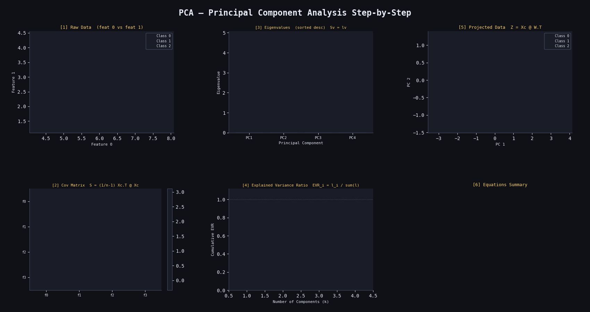

# 🔻 PCA (Principal Component Analysis) from Scratch

A clean NumPy implementation of PCA for dimensionality reduction, demonstrated on the Iris dataset projected down to 2 principal components.

---

## 📁 Project Structure

```
├── pca.py       # Core PCA implementation
└── main.py      # Fit, transform & visualise
```

---

## ⚙️ How It Works

PCA finds the directions of **maximum variance** in the data and projects it onto a lower-dimensional subspace while preserving as much information as possible.

---

### 1. 📐 Mean Centering

Before anything, subtract the feature-wise mean so the data is centred at the origin:

$$X_{\text{centered}} = X - \bar{X}, \qquad \bar{X} = \frac{1}{n}\sum_{i=1}^{n} x_i$$

---

### 2. 🔢 Covariance Matrix

The covariance matrix captures how every pair of features varies together:

$$\Sigma = \frac{1}{n-1} X_{\text{centered}}^{\top} X_{\text{centered}} \in \mathbb{R}^{p \times p}$$

- Diagonal entries = variance of each feature
- Off-diagonal entries = covariance between feature pairs
- $\Sigma$ is always **symmetric** and **positive semi-definite**

---

### 3. 🧮 Eigendecomposition

Decompose the covariance matrix to find its eigenvectors and eigenvalues:

$$\Sigma \mathbf{v} = \lambda \mathbf{v}$$

- $\lambda$ (eigenvalue) = amount of variance explained by this direction
- $\mathbf{v}$ (eigenvector) = the direction itself (a principal component)

Sort by eigenvalue in **descending order** to rank components by importance:

$$\lambda_1 \geq \lambda_2 \geq \cdots \geq \lambda_p$$

---

### 4. ✂️ Select Top-k Components

Keep only the first $k$ eigenvectors as the new basis:

$$W = [\mathbf{v}_1 \mid \mathbf{v}_2 \mid \cdots \mid \mathbf{v}_k] \in \mathbb{R}^{p \times k}$$

---

### 5. 📉 Explained Variance Ratio

How much total variance each component captures:

$$\text{EVR}_i = \frac{\lambda_i}{\sum_{j=1}^{p} \lambda_j}$$

The cumulative sum tells you how much information is retained with k components.

---

### 6. 🔁 Projection (Transform)

Project the original data onto the k principal components:

$$Z = X_{\text{centered}} \cdot W \in \mathbb{R}^{n \times k}$$

---

## 🛠️ Key Attributes (after `.fit()`)

| Attribute | Shape | Description |
|---|---|---|
| `_mean` | `(n_features,)` | Feature-wise mean for centering |
| `components` | `(k, n_features)` | Top-k eigenvectors (principal axes) |

---


## 📦 Dependencies

```
numpy
scikit-learn
matplotlib
```
---
## Results
<p align="center">
  
</p>