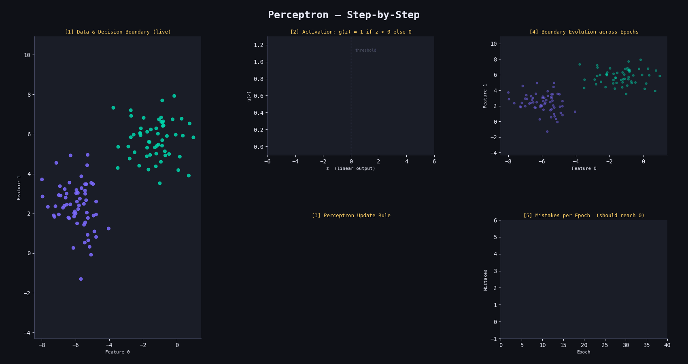

#  Perceptron Classifier from Scratch

A clean NumPy implementation of the Perceptron — the simplest neural network unit — trained on a linearly separable binary dataset using the classic online update rule.

---

##   Project Structure

```
├── perceptron.py    # Core Perceptron implementation
└── main.py          # Training, evaluation & decision boundary plot
```

---

##  How It Works

The Perceptron is a **linear binary classifier** inspired by a biological neuron. It learns a hyperplane that separates two classes by iteratively correcting misclassified samples.

---

### 1.   Linear Output

The raw output is a weighted sum of inputs plus a bias:

$$z = \mathbf{w}^T \mathbf{x} + b = \sum_{j=1}^{p} w_j x_j + b$$

---

### 2.   Activation Function (Unit Step)

The linear output is passed through a unit step function:

$$\hat{y} = g(z) = \begin{cases} 1 & \text{if } z > 0 \\ 0 & \text{otherwise} \end{cases}$$

This converts the continuous score into a hard binary prediction.

---

### 3.  Perceptron Update Rule

For each training sample $(x_i, y_i)$, weights are updated only when a mistake is made:

$$\Delta w = \eta \cdot (y_i - \hat{y}_i) \cdot x_i$$
$$\Delta b = \eta \cdot (y_i - \hat{y}_i)$$

So the full update is:

$$\mathbf{w} \leftarrow \mathbf{w} + \Delta w, \qquad b \leftarrow b + \Delta b$$

- If prediction is **correct**: $y_i - \hat{y}_i = 0$ → no update
- If prediction is **wrong**: weights shift toward or away from $x_i$

---

### 4.  Decision Boundary

The decision boundary is the hyperplane where $z = 0$:

$$\mathbf{w}^T \mathbf{x} + b = 0$$

In 2D, solving for $x_2$:

$$x_2 = \frac{-w_1 x_1 - b}{w_2}$$

---

### 5.  Convergence Theorem

If the data is **linearly separable**, the Perceptron is guaranteed to converge in a finite number of steps. The bound on mistakes $M$ is:

$$M \leq \left(\frac{R}{\gamma}\right)^2$$

where $R = \max_i \|x_i\|$ is the max data norm and $\gamma$ is the margin (distance between classes and the boundary).

---


##  Parameters

| Parameter | Default | Description |
|---|---|---|
| `learning_rate` | `0.01` | Step size for weight updates |
| `n_iters` | `1000` | Number of passes over the training data |

---

## Results
<p align="center">
  
</p>