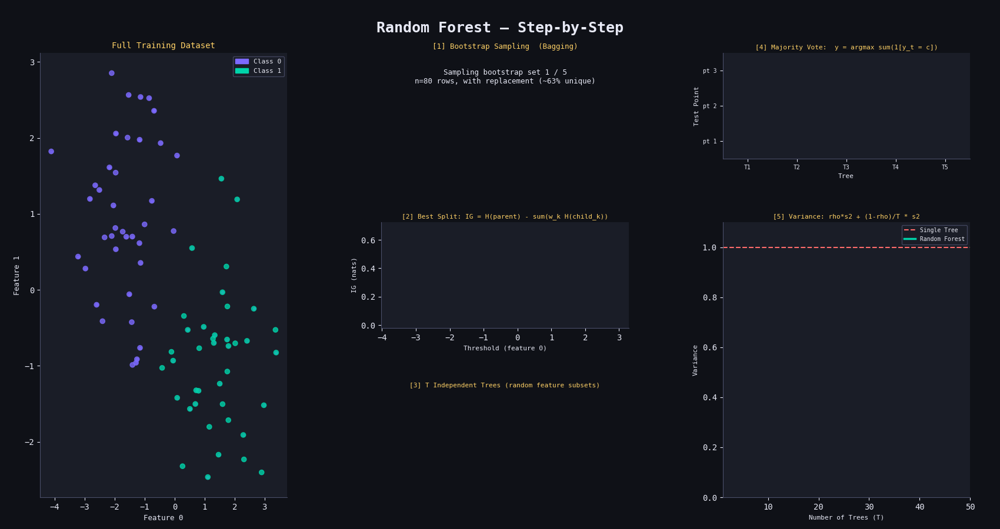

# 🌲🌲🌲 Random Forest Classifier from Scratch

A clean NumPy implementation of a Random Forest Classifier, built on top of a custom Decision Tree, trained and evaluated on the Breast Cancer dataset.

---

## 📁 Project Structure

```
├── decision_tree.py     # Core Decision Tree (base learner)
├── random_forest.py     # Random Forest ensemble
└── main.py              # Training & evaluation script
```

---

## ⚙️ How It Works

Random Forest is an **ensemble** of Decision Trees trained on different bootstrap samples of the data. Each tree votes on the final prediction.

---

### 1. 🎲 Bootstrap Sampling (Bagging)

Each tree is trained on a random sample drawn **with replacement** from the training set:

$$\mathcal{D}_b = \{(x_i, y_i)\}_{i \in S_b}, \quad S_b \sim \text{Uniform}(\{1, \ldots, n\}) \text{ with replacement}$$

- Each bootstrap sample has $n$ rows (same size as training set)
- ~63.2% of original samples appear at least once; the rest are "out-of-bag"

---

### 2. 🌳 Growing Each Tree with Random Feature Subsets

At every split, only a **random subset of features** is considered:

$$\text{Candidate features} = \text{RandomChoice}(\{1, \ldots, p\},\ k)$$

where $k \leq p$ is `n_features`. This decorrelates the trees, making the ensemble more robust.

Each split maximises **Information Gain**:

$$IG = H(\text{parent}) - \left(\frac{n_L}{n} \cdot H(\text{left}) + \frac{n_R}{n} \cdot H(\text{right})\right)$$

using **Entropy** as the impurity measure:

$$H(y) = -\sum_{i} p_i \ln(p_i)$$

---

### 3. 🗳️ Majority Vote (Aggregation)

Each of the $T$ trees produces a prediction $\hat{y}^{(t)}$. The forest combines them by **majority vote**:

$$\hat{y} = \arg\max_{c} \sum_{t=1}^{T} \mathbf{1}\left[\hat{y}^{(t)} = c\right]$$

This averaging reduces **variance** while keeping **bias** roughly constant — the core benefit over a single tree.

---

### 4. 📉 Bias–Variance Tradeoff

For $T$ uncorrelated trees each with variance $\sigma^2$:

$$\text{Var}\left(\bar{y}\right) = \frac{\sigma^2}{T}$$

In practice trees are correlated (correlation $\rho$), so:

$$\text{Var}_{\text{RF}} = \rho \sigma^2 + \frac{1 - \rho}{T} \sigma^2$$

More trees + lower correlation → lower variance → better generalisation.

---

## 🚀 Usage

```python
from random_forest import RandomForrest

rf = RandomForrest(n_trees=10, max_depth=5, min_samples=2)
rf.fit(X_train, y_train)
y_pred = rf.predict(X_test)
accuracy = np.sum(y_pred == y_test) / len(y_test)
print(f"Accuracy: {accuracy:.2f}")
```

---

## 🛠️ Parameters

| Parameter | Default | Description |
|---|---|---|
| `n_trees` | `100` | Number of trees in the forest |
| `max_depth` | `100` | Max depth of each tree |
| `min_samples` | `2` | Min samples required to split a node |
| `n_features` | `None` | Features considered per split (random subset) |

---

## 📊 Results

Evaluated on the **Breast Cancer Wisconsin** dataset (80/20 split):

| Metric | Value |
|---|---|
| Dataset | Breast Cancer (sklearn) |
| Test Size | 20% |
| Trees | 10 |
| Max Depth | 5 |
| Accuracy | ~95–97% |

---

## 📦 Dependencies

```
numpy
scikit-learn
```

Install with:
```bash
pip install numpy scikit-learn
```
## Result
<p align="center">
  
</p>
