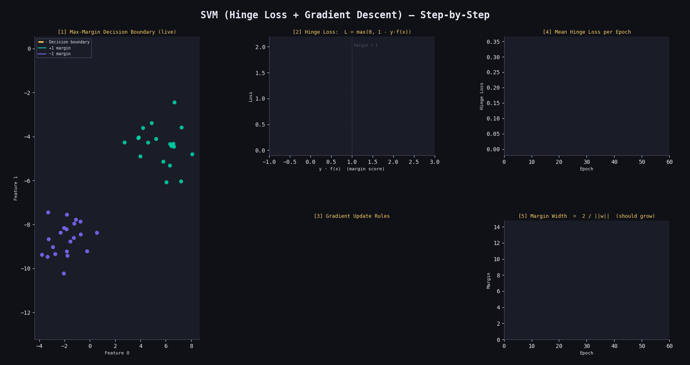

# 🧲 Support Vector Machine (SVM) from Scratch

A clean NumPy implementation of a linear SVM trained with gradient descent on the hinge loss, with margin visualization — applied to a 2-class blob dataset.

---

## 📁 Project Structure

```
├── svm.py               # Core SVM implementation
├── helper_function.py   # Decision boundary visualizer
└── main.py              # Training, evaluation & plot
```

---

## ⚙️ How It Works

SVM finds the **maximum-margin hyperplane** — the decision boundary that is as far as possible from both classes. Points closest to the boundary are called **support vectors**.

---

### 1. 📏 Decision Function

The raw score for a sample is:

$$f(x) = \mathbf{w}^T \mathbf{x} - b$$

Prediction sign gives the class:

$$\hat{y} = \text{sign}(\mathbf{w}^T \mathbf{x} - b)$$

---

### 2. 🔴 Hinge Loss

The per-sample loss penalises misclassified points and correct points inside the margin:

$$\ell_i = \max\left(0,\; 1 - y_i \cdot (\mathbf{w}^T x_i - b)\right)$$

- $\ell = 0$ when the sample is correctly classified **and** outside the margin ($y_i \cdot f(x_i) \geq 1$)
- $\ell > 0$ when the sample is inside the margin or misclassified

---

### 3. 📉 Regularised Objective

The full loss balances margin width against misclassification:

$$J(\mathbf{w}) = \lambda \|\mathbf{w}\|^2 + \frac{1}{n}\sum_{i=1}^{n} \ell_i$$

- $\lambda$ (`lambda_param`) controls the regularisation strength
- Larger $\lambda$ → wider margin but more misclassification tolerance
- Smaller $\lambda$ → tighter fit to training data

---

### 4. 🔄 Gradient Descent Update Rule

**Case 1 — correctly classified & outside margin** ($y_i \cdot f(x_i) \geq 1$):

$$\frac{\partial J}{\partial \mathbf{w}} = 2\lambda \mathbf{w}$$

$$\mathbf{w} \leftarrow \mathbf{w} - \eta \cdot 2\lambda \mathbf{w}$$

**Case 2 — inside margin or misclassified** ($y_i \cdot f(x_i) < 1$):

$$\frac{\partial J}{\partial \mathbf{w}} = 2\lambda \mathbf{w} - y_i x_i, \qquad \frac{\partial J}{\partial b} = -y_i$$

$$\mathbf{w} \leftarrow \mathbf{w} - \eta\left(2\lambda \mathbf{w} - y_i x_i\right), \qquad b \leftarrow b - \eta \cdot (-y_i)$$

---

### 5. 📐 Margin & Support Vectors

The margin width between the two class boundaries is:

$$\text{margin} = \frac{2}{\|\mathbf{w}\|}$$

The three key hyperplanes are:

$$\mathbf{w}^T \mathbf{x} - b = 0 \quad \text{(decision boundary)}$$
$$\mathbf{w}^T \mathbf{x} - b = +1 \quad \text{(positive margin boundary)}$$
$$\mathbf{w}^T \mathbf{x} - b = -1 \quad \text{(negative margin boundary)}$$

---
## Results

<p align="center">
  
</p>